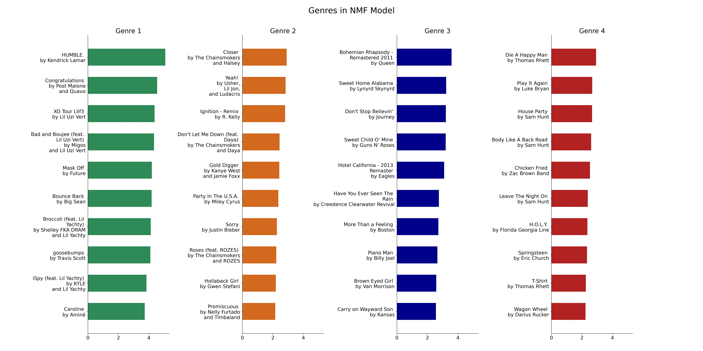
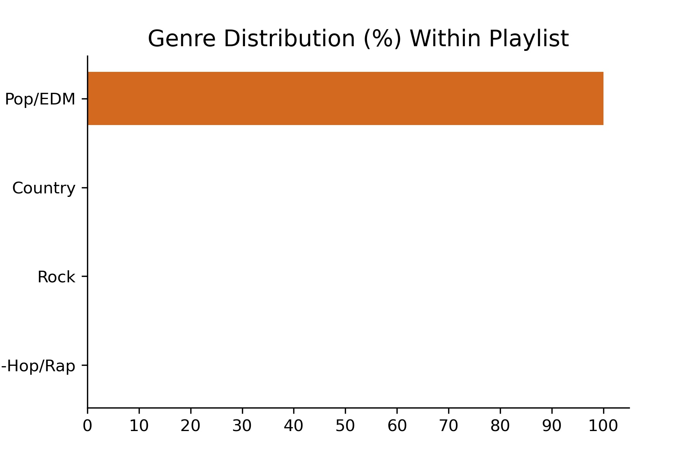

# Music to My Ears

**Author:** [Vu Brown](https://www.linkedin.com/in/austin-brown-b5211384/)

## Overview
This project develops a content-based filtering recommendation system for musical tracks by utilizing a multilabel binarizer as a preprocessing tool on a million user playlists. This creates a large scale utility matrix (1,000,000 by 2,262,292) comprised of playlists and tracks, which is used with Non-negative Matrix Factorization (NMF) along side cosine similarity to build the model.

## Business Objective
This project explores unsupervised learning in an attempt to develop a musical track recommendation system simply based off of user playlists. Inspiration for this project came from Spotify's weekly generated playlist called Discover Weekly. The playlist consists of 30 tracks that the user has never heard before but are curtailed to the user's personal music preferences. Although I do not expect to create a recommendation system better than Spotify's Discover Weekly, I would like to explore a unique way this recommendation system could be built.

## The Data
The data used in this project was sourced from:
* A data package provided from [AIcrowd](https://www.aicrowd.com/challenges/spotify-million-playlist-dataset-challenge/dataset_files) consisting of 1,000,000 playlists.
* API calls to the [Spotify Web API|Spotify for Developers](https://developer.spotify.com/dashboard/applications).

**IMPORTANT NOTICE**
* The data package from AIcrowd is much too large to upload to GitHub. You will have to navigate to the link above, download the data package (ZIP file - 5.39GB) to the project folder on your local computer, and then extract the contents from the ZIP file there.

## Preprocessing
Before I begin modeling, I create a utility matrix consisting of playlists (rows) and tracks included in those playlists (columns). Since I'm unable to obtain actual Spotify user data, the assumption I'm making is that each playlist acts as an individual user's musical preference. Therefore, if I were too build a utility matrix as described, I would be able to develop a content-based filtering recommendation system from users' musical preferences.

The data package provided from AIcrowd is split into 1,000 separate JSON files which each include 1,000 playlists, totaling 1,000,000 playlists. The package also includes a useful TEXT file, `stats.txt`, that has a basic summary of aspects regarding the dataset. The TEXT file is particularly useful in that it informs me to expect 2,262,292 unique tracks. Given this information, I create a 1,000,000 by 2,262,292 utilitly matrix to be used for modeling.

### Utility Matrix Set-Up & Multilabel Binarizer
The first step I take towards building this utility matrix is to read from every JSON file and extract a list of Spotify track URIs for each playlist. I then utilize a multilabel binarizer to create the utility matrix filled with ones and zeros signifying whether or not a specific track is included in any of the one million playlists. Since most of the elements in our utility matrix will be zero-valued, I utilize scikit-learn's `MultiLabelBinarizer` to output a CSR matrix, which is ideal for reducing memory consumption (the largest hurdle I had to overcome in this portion of the project).

## Modeling
In this section, I create a musical track recommendation system by using the utility matrix developed through preprocessing. Non-negative Matrix Factorization (NMF) and cosine similarity are employed by the system to generate the track recommendations.

### Spotify Web API
In order for all code in this section to execute properly, you will need your own unique Client ID and Client Secret. Here is how to create a Spotify Web App through the Spotify Web API to obtain them:
   * Create Spotify profile or sign in with your Spotify credentials [here](https://developer.spotify.com/dashboard/applications).
   * On the Spotify for Developers Dashboard, navigate to the "Create An App" button and fill-in/agree to all items.
   * Your unique Client ID and Client Secret will then be displayed within your newly created Web App.

### Non-negative Matrix Factorization (NMF)
Since there are so many tracks and playlists in the utility matrix, a dimensionality reduction algorithm needs to be employed, which is where NMF comes in. NMF factorizes one matrix with non-negative elements, in our case the utility matrix, into two separate matrices, W and H, which will resultingly also have non-negative elements. The non-negativity of the elements allows the resulting factorized matrices to be more easily interpretable.

$$U = WH$$
    
One dimension of the each of the factorized matrices will be significantly smaller, and in that dimension is where interesting, hidden features can be identified. The exact size of this dimension can also be tuned, and, as such, this is where the majority of my experimentation stemmed from. I used various hidden feature amounts ranging from 2 to 10, and I began to notice that the algorithm was trying to match a major genre with each hidden feature. However, when the hidden feature amount was too small or too large, the algorithm wasn't optimized. This was easily identifiable when looking at the actual genres associated with the top tracks in each hidden feature and observing genre overlap amongst the top tracks. With that being said, the algorithm seemed to be categorizing tracks by genre at its best with 4 hidden features. Notice in the graphic below how Genre 1 is mainly associated with Hip-Hop/Rap, Genre 2 with Pop/EDM, Genre 3 with Rock, and Genre 4 with Country.


### Selecting a Playlist & Cosine Similarity
I select a playlist that I enjoy, which consists of EDM music. I then verify that the model identifies them as EDM tracks, which it does.


After selecting a playlist, I perform pair-wise cosine similarity between our playlist and all tracks. In doing this, I find tracks that are most similar to the selected playlist and ultimately recommend those tracks.

## Results
Interestingly, of the top 10 recommended tracks, tracks 1, 3, 4, 5, and 9, were EDM related, and tracks 2, 5, 7, 8, and 10 were Spanish-speaking related. This isn't ideal, but I would say that of the 5 EDM tracks I subjectively like 3 of them (tracks 1, 3, and 4), and I've never heard of any of the artists before which is great for being exposed to new artists. Unfortunately, the Spotify API does not have a track language attribute, which would be ideal for identifying tracks that are not in the English language and excluding them from the recommendation list.

I implore you to try out other playlists and see what the model recommends.

## Conclusions
Although the model is not great considering the track recommendations are a little wonky, consider what data was used: playlists. Not a single characteristic of a track was actually utilized. No audio features, no track names, no artist names, no release info, etc. Just playlists. This was a limitation I knew coming into this project, but, considering that simple fact, this model works surprisingly well in that it can even recommend a few tracks remotely similar to those within a given playlist.

## Next Steps
When time permits, I would like to introduce track characteristics into this model and see how that would affect the model's performance. Spotify's Web API has just this capability as well when utilizing the function `audio_features` on a track. In addition, it could be useful to explore supervised learning techniques and build a classification model using Spotify's track popularity metric to predict top hits. Perhaps the combination of the two models could yield fascinating results.

## Appendix
I include a function that takes a transposed factorized matrix, H, which consists of hidden features associated with playlists, and plots the top playlists in each hidden feature. This function can be particularly useful in identifing playlists that strongly lean towards a specific hidden feature

## For More Information
Please review our full analysis in our [Jupyter Notebook](./main_notebook.ipynb) or [presentation deck](./presentation.pdf).

For additional questions, please contact [Vu](mailto:avbrown313@gmail.com).

## Repository Structure
```
├── README.md                           <- The top-level README for viewers of this repository
├── main_notebook.ipynb                 <- Narrative documentation of analysis performed in Jupyter Notebook
├── modeling_notebook.ipynb             <- Supplemental documentation of modeling performed in Jupyter Notebook
├── preprocessing_notebook.ipynb        <- Supplemental documentation of preprocessing performed in Jupyter Notebook
├── presentation.pdf                    <- PDF version of presentation to stakeholders
├── tmp                                 <- Temporary variables saved from Jupyter Notebooks (to reduce time executing code)
└── images                              <- Images generated from main Jupyter Notebook

```
